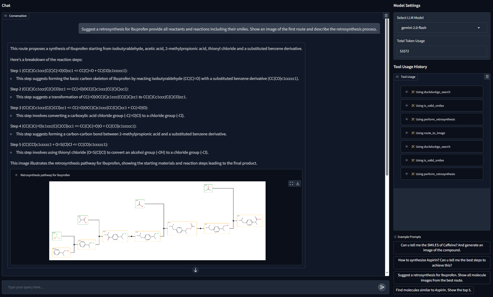

# ReAgentAI

ReAgentAI is an advanced chemical assistant powered by AI that provides comprehensive support for chemistry-related tasks. Built with state-of-the-art machine learning models and chemical informatics tools, ReAgentAI enables researchers, chemists, and students to explore chemical space, perform retrosynthetic analysis, and visualize molecular structures with unprecedented ease and accuracy.

<!-- centerize image -->


## 🚀 Features

### Core Capabilities
- **Retrosynthesis Planning**: Generate synthetic routes for target molecules using AiZynthFinder with USPTO-trained models
- **Molecular Visualization**: Create high-quality images of chemical structures and reaction pathways
- **Similarity Search**: Find structurally similar molecules using molecular fingerprints and Tanimoto similarity
- **SMILES Validation**: Verify and validate SMILES strings for chemical accuracy
- **Chemical Information Retrieval**: Access comprehensive chemical data through PubChem integration
- **Chemical Name/SMILES Conversion**: Convert between chemical names and SMILES using authoritative PubChem database
- **Chemical Knowledge**: Access comprehensive chemistry information through integrated web search

### Integrated Databases & Models
- **USPTO-trained models**: Leveraging one of the largest chemical reaction databases
- **ZINC stock collection**: Access to commercially available compounds
- **PubChem database**: Integration with the NIH's comprehensive chemical database
- **Curated molecular datasets**: ~16,000 drug-like molecules for similarity searches

## 🛠 Setup

### Prerequisites
- Python 3.10 or 3.11
- Gemini API key for AI functionality

### Environment Configuration
Create a `.env` file in the root directory:
```env
GEMINI_API_KEY=your_gemini_api_key
```

### Installation Options

#### Option 1: Setup with uv (Recommended)
```sh
uv run download_public_data data 
uv run run.py
```

#### Option 2: Setup with pip
```sh
python -m venv .venv --upgrade-deps &&
source .venv/bin/activate &&
pip install . &&
download_public_data data &&
python run.py
```

**Note**: The `download_public_data data` command downloads:
- A pre-trained retrosynthesis model based on USPTO patent data
- A stock collection from the ZINC database containing commercially available compounds

### 🐳 Docker Setup

For containerized deployment:

1. **Download required data**:
   ```shell
   uv run download_public_data data
   ```

2. **Build the Docker image**:
   ```sh
   sudo docker build -t reagentai .
   ```

3. **Run the container**:
   ```sh
   sudo docker compose up
   ```

4. **Access the application**:
   Open your browser and navigate to: http://127.0.0.1:7860/

## 💡 Usage Examples

ReAgentAI supports various chemistry-related queries:

- **Retrosynthesis**: "How can I synthesize aspirin?" or "Show me synthetic routes for caffeine"
- **Molecular similarity**: "Find molecules similar to ethanol" or "What compounds are structurally related to benzene?"
- **Structure visualization**: "Show me the structure of morphine" or "Generate an image of the synthesis route"
- **Chemical validation**: "Is this SMILES string valid: CCO?"
- **Chemical information**: "What is the IUPAC name and molecular formula of Paracetamol?"
- **Name to SMILES**: "What is the SMILES string for Gabapentin?"
- **SMILES to name**: "What chemical name corresponds to this SMILES: CN1C=NC2=C1C(=O)N(C(=O)N2C)C?"
- **General chemistry**: "What are the properties of acetaminophen?"

## 🔧 Architecture

ReAgentAI is built with:
- **Pydantic AI**: For robust AI agent framework
- **RDKit**: Chemical informatics and molecular manipulation
- **AiZynthFinder**: Retrosynthetic analysis engine
- **PubChemPy**: Interface for accessing the PubChem database
- **Google Gemini**: Large language model for natural language processing
- **Gradio**: User-friendly web interface

## 🔍 Troubleshooting

### Common Issues

**ONNX Runtime Import Error**:
```
ImportError: PATH_TO_PROJECT_DIRECTORY/.venv/lib/python3.10/site-packages/onnxruntime/capi/onnxruntime_pybind11_state.cpython-310-x86_64-linux-gnu.so: cannot enable executable stack as shared object requires: Invalid argument
```

**Solution**:
```sh
execstack -c PATH_TO_PROJECT_DIRECTORY/.venv/lib/python3.10/site-packages/onnxruntime/capi/onnxruntime_pybind11_state.cpython-310-x86_64-linux-gnu.so
```

### Data Sources & Datasets
- `popular_smiles.csv`: ~16,000 drug-like molecules sourced from [Big Molecules SMILES Dataset](https://www.kaggle.com/datasets/yanmaksi/big-molecules-smiles-dataset) on Kaggle
- **USPTO patent data**: Downloaded automatically via the `download_public_data` command from aizynthfinder.
- **ZINC database**: Downloaded automatically via the `download_public_data` command from aizynthfinder.

> **Note**: This project's license does not apply to the external datasets, API's or tools. Please refer to their respective licenses and terms of use.


## 📄 License

This project is licensed under the MIT License — see the [LICENSE](LICENSE) file for details.

---

*ReAgentAI: Advancing chemistry through intelligent automation* 🧪⚗️
